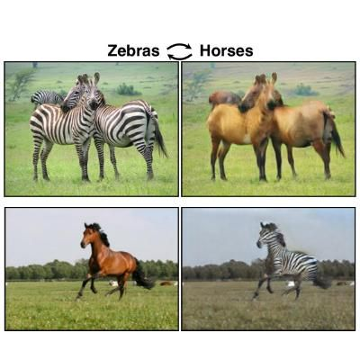

# SAMSUNGxKAIST-AI (07/31 과제)

[과제 설명]

이번 과제는 horse2zebra Dataset을 사용하여 CycleGAN을 학습시키는 것입니다. 
다음은 horse2zebra Dataset의 예시 사진입니다.

과제를 하는 순서는 다음과 같습니다.

1. download_cyclegan_dataset.sh 과 cyclegan_horse2zebra_assign.ipynb 을 같은 폴더에 받습니다.
2. cyclegan_horse2zebra_assign.ipynb 의 ???인 부분을 채웁니다.
3. 채운 ipynb의 모든 셀을 순서대로 실행합니다. (학습시간은 약 1시간 정도 걸릴 것으로 예상됩니다.)
4. 코드를 실행시키면 생성되는 logs 폴더에 변환된 이미지들이 저장되는 것을 확인합니다.

[제출]

ipynb 파일이 들어있는 폴더를 모두 압축하여 psh01087@gmail.com 로 보내주세요.